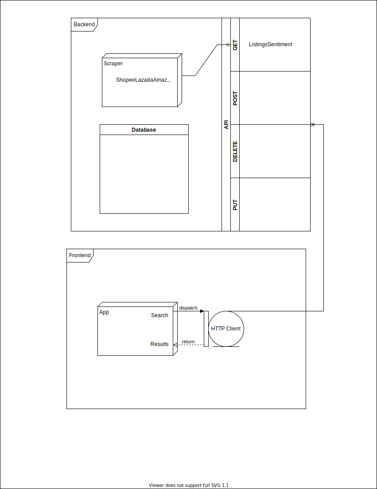

# Yuview

## Getting Started

### Main Tech

npm: 8.6.0

Python: 3.9.12

spaCy: 3.3.0

Scrapy: 2.6.1

FastAPI: 0.78.0

React: 18.1.0

### Dependencies

For client-side, run `npm install` or `yarn install`.
For server-side, run `pip install -r requirements.txt` in the /server directory.

## Web App

 `yarn start`

Runs the app in the development mode.\
Open [http://localhost:3000](http://localhost:3000) to view it in your browser.

The page will reload when you make changes.\
You may also see any lint errors in the console.

## Server

```
cd server/
python main.py
```

Starts the server at root url [http://localhost:8000](http://localhost:8000).
Go to the interactive API documentation at [http://localhost:8000/docs](http://localhost:8000/docs).

## Project Vision

In modern society, it is common for people to make use of online shopping to purchase their products due to its convenience and affordability. However, one thing we realised was that despite the large number of reviews on a product, nobody will actually spend time reading through every single review as it can be very tedious and tiring. Furthermore, although a star rating is displayed to reflect the general satisfaction level of consumers, what buyers are looking for are mostly the adjectives or descriptions given by the reviews, hence the star rating is not as important as the written reviews.

## Summary

We aim to create a web extension that takes in all the reviews for a product and summarises them based on most frequently used phrases or words, thus making reviews easier and more efficient for buyers to digest.
A Google Chrome browser extension that identifies the product a user is interested in from the webpage and retrieves data from various e-commerce sites, collating information such as user ratings, reviews and prices.

## User Stories

- As a buyer who wants to make a choice between multiple products, I want to be able to read reviews more efficiently and get a consensus of others’ opinions.
- As a seller, I want buyers to be more convinced on the products I am selling before they decide on whether they purchase them or not.
- As a user of online shopping websites, I do not want to spend too much time scrolling through each review.

## Core Features
The server employs natural language processing (NLP) techniques to deliver a concise summary of all user reviews and provides an aggregate “value” rating.

The user now has a comparison with different purchase options and is able to access links which redirect them to these sites or bookmark the query.

Fig 1. Home page


Fig 2. Top bar, which consists of a search tool as well as a drop down tool


## Tech Stack
# spaCy
We used spaCy as our main natural language processing tool in order to process the data that we scraped and then use it to create our reviews
# FastAPI

# Scrapy
We used Scrapy to scrape data of the shopping website
# NodeJS
NodeJS was used for the installation of packages
# Github
Our project is uploaded onto github and any changes are reflected within the repository. It is also used for us to push/pull new content that we are working on.

## Challenges faced
Initially, we intended to work on the data extraction and API first, starting off with Shopee as our first target site. However, we hit a roadblock and realised that Shopee Open API was restricted to sellers and third-party businesses. After trying to find a workaround, we fell back to the less ideal solution of web scraping.

Our approach of directly scraping the HTML DOM using the Scrapy framework was unsuccessful due to the dynamic loading of JS scripts. We then attempted using Selenium + BeautifulSoup to interact with the browser directly. Even though the second approach worked, it was too inefficient due to the time delays required for automated browser input like scrolling and clicking. Eventually, we arrived at the solution of making HTTP requests directly to the Shopee internal API by searching through network data for the link templates.

Originally, we were planning to have our code perform the filtering for multiple product listings at one go, but the code was taking too long to run, hence we decided to adjust the code such that it runs for a single product listing based on the page that the user is on.


## Architecture



## Progress


### Milestone 1

For the NLP side of things, we used spaCy to create a code that allowed us to filter out and arrange reviews based on most frequently used words. The code also allows for filtering based on adjectives, adverbs, etc. The code also matches words as synonyms based on similarity, thus creating a more succinct review. We’ve tested out the code with different reviews, but we are still in the process of deciding a suitable similarity percentage for synonyms as well as creating more ways for users to filter the reviews.

Initially, we intended to work on the data extraction and API first, starting off with Shopee as our first target site. However, we hit a roadblock and realised that Shopee Open API was restricted to sellers and third-party businesses. After trying to find a workaround, we fell back to the less ideal solution of web scraping.

Our approach of directly scraping the HTML DOM using the Scrapy framework was unsuccessful due to the dynamic loading of JS scripts. We then attempted using Selenium + BeautifulSoup to interact with the browser directly. Even though the second approach worked, it was too inefficient due to the time delays required for automated browser input like scrolling and clicking. Eventually, we arrived at the solution of making HTTP requests directly to the Shopee internal API by searching through network data for the link templates.

The next step would be to clean and filter the retrieved data for processing use and ensuring no rate/requests limits on our scraping method, identifying workarounds if needed.

### Milestone 2

One key feedback that we received from milestone 1 was that we did not have anything to show what we had done, such as a mockup of the browser extension. Hence, for milestone 2, our first main focus was creating a working client.

We also started to explore more ways to process the data that we were gathering through our scraping method, such as classifying words based on sentiment analysis. Originally, we were planning to have our code perform the filtering for multiple product listings at one go, but the code was taking too long to run, hence we decided to adjust the code such that it runs for a single product listing based on the page that the user is on.

Taking the Material Design approach for our UI, our user-facing page consists of a sleek and minimal layout, prioritising the clarity and readability of product searches. Future additions for the final milestone would include more information at a single glance such as the product image and recommendation. The API calls required is simple due to the absence of user data storage and the simultaneous retrieval of scraped data.

The biggest improvement in terms of efficiency would be an addition of a query database that provides the product summaries to users upon request. We hope to incorporate a database in the next milestone to avoid the delay in listing consolidation.
